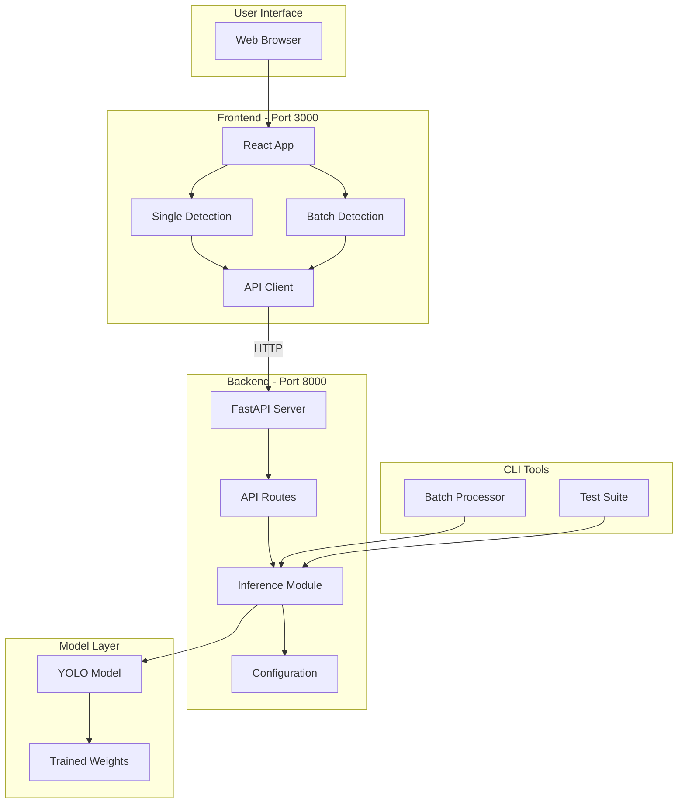

# 📁 Project Structure

Complete overview of the Brain Tumor Detection System architecture.

## Directory Tree

```
YOLOV10-cbam-fifpn/
│
├── 📱 FRONTEND (React + TypeScript)
│   └── frontend/
│       ├── src/
│       │   ├── components/
│       │   │   ├── SingleImageDetection.tsx    # Single image UI
│       │   │   ├── SingleImageDetection.css
│       │   │   ├── BatchImageDetection.tsx     # Batch processing UI
│       │   │   └── BatchImageDetection.css
│       │   ├── App.tsx                         # Main app component
│       │   ├── App.css
│       │   ├── api.ts                          # API client
│       │   ├── main.tsx                        # Entry point
│       │   ├── index.css                       # Global styles
│       │   └── vite-env.d.ts                   # Type declarations
│       ├── index.html                          # HTML template
│       ├── package.json                        # Node dependencies
│       ├── vite.config.ts                      # Vite configuration
│       ├── tsconfig.json                       # TypeScript config
│       ├── tsconfig.node.json
│       ├── .gitignore
│       └── README.md                           # Frontend docs
│
├── 🔧 BACKEND (FastAPI + Python)
│   └── backend/
│       ├── app/
│       │   ├── __init__.py
│       │   ├── main.py                         # FastAPI routes
│       │   ├── inference.py                    # Shared inference
│       │   ├── config.py                       # Configuration
│       │   └── schemas.py                      # Pydantic models
│       └── __init__.py
│
├── 🎓 TRAINING (Model Training)
│   └── training/
│       ├── __init__.py
│       ├── fyp.py                              # Training script
│       ├── exmodule.py                         # CBAM & BiFPN modules
│       ├── yolov10n_CBAM.yaml                  # Model config
│       └── README.md                           # Training docs
│
├── 🤖 MODEL WEIGHTS
│   └── Trained_model/
│       ├── YOLOv10CM_FYPtrained.pt            # Main model ⭐
│       ├── YOLOv10_FYPtrained.pt
│       ├── YOLOv11_FYPtrained.pt
│       ├── YOLOv8_FYPtrained.pt
│       └── YOLOv9_FYPtrained.pt
│
├── 📊 DATASET
│   └── dataset/
│       ├── train/
│       │   ├── Glioma/
│       │   │   ├── images/
│       │   │   └── labels/
│       │   ├── Meningioma/
│       │   ├── No Tumor/
│       │   └── Pituitary/
│       └── val/
│           └── (same structure as train)
│
├── 🚀 LAUNCHERS & TOOLS
│   ├── run_ui.py                               # Main launcher (FastAPI)
│   ├── start_dev.py                            # Dev environment starter
│   ├── start_dev.bat                           # Windows starter script
│   ├── test_ui.py                              # Test suite
│   └── utils/                                  # CLI utilities
│       └── batch_processor.py                  # CLI batch processor
│
├── 📚 DOCUMENTATION
│   ├── README.md                               # Main documentation
│   ├── SETUP_GUIDE.md                          # Setup instructions
│   ├── QUICK_REFERENCE.md                      # Quick reference
│   ├── MIGRATION_COMPLETE.md                   # Migration summary
│   └── PROJECT_STRUCTURE.md                    # This file
│
├── 🗂️ CONFIGURATION
│   ├── requirements.txt                        # Python dependencies
│   ├── .gitignore                              # Git ignore rules
│   └── .venv/                                  # Python virtual env
│
└── 🗄️ ARCHIVE (Deprecated)
    ├── FYPUI.py                                # Old Gradio UI
    └── README.md                               # Archive info
```

## Component Relationships



## Data Flow

### Single Image Detection

```
User uploads image
    ↓
React Component (SingleImageDetection.tsx)
    ↓
API Client (api.ts) → POST /api/detect
    ↓
FastAPI Route (main.py)
    ↓
Inference Module (inference.py)
    ↓
YOLO Model prediction
    ↓
Draw annotations
    ↓
Return annotated image + detections
    ↓
Display in React
```

### Batch Processing

```
User uploads multiple images
    ↓
React Component (BatchImageDetection.tsx)
    ↓
API Client (api.ts) → POST /api/batch
    ↓
FastAPI Route (main.py)
    ↓
Loop through images
    ↓
Inference Module (inference.py) for each
    ↓
Create ZIP file in memory
    ↓
Return ZIP with all processed images
    ↓
Download in browser
```

## File Purposes

### Frontend Files

| File | Purpose |
|------|---------|
| `App.tsx` | Main app shell, tabs, layout, health check |
| `api.ts` | API client functions for backend communication |
| `SingleImageDetection.tsx` | Single image upload, detection, display |
| `BatchImageDetection.tsx` | Multiple image upload, batch processing |
| `*.css` | Component-specific styles |
| `vite.config.ts` | Build configuration, dev server, proxy |

### Backend Files

| File | Purpose |
|------|---------|
| `main.py` | FastAPI app, routes, CORS, startup events |
| `inference.py` | Model loading, prediction, annotation (shared) |
| `config.py` | Paths, class names, configuration |
| `schemas.py` | Pydantic models for API request/response |

### Utility Files

| File | Purpose |
|------|---------|
| `run_ui.py` | Backend launcher with checks |
| `start_dev.py` | Start both servers (cross-platform) |
| `start_dev.bat` | Start both servers (Windows batch) |
| `utils/batch_processor.py` | CLI batch processing tool |
| `test_ui.py` | Test suite for backend |

### Training Files

| File | Purpose |
|------|---------|
| `training/fyp.py` | Training script |
| `training/exmodule.py` | Custom CBAM and BiFPN modules |
| `training/yolov10n_CBAM.yaml` | Model architecture definition |
| `Trained_model/YOLOv10CM_FYPtrained.pt` | Trained model weights |

## API Endpoints

| Endpoint | File | Function |
|----------|------|----------|
| `GET /` | `main.py` | `root()` |
| `GET /api/health` | `main.py` | `health_check()` |
| `POST /api/detect` | `main.py` | `detect_single_image()` |
| `POST /api/detect-json` | `main.py` | `detect_single_image_json()` |
| `POST /api/batch` | `main.py` | `process_batch_images()` |
| `POST /api/batch-json` | `main.py` | `process_batch_images_json()` |
| `GET /docs` | Auto-generated | Swagger UI |

## Configuration Files

| File | Purpose |
|------|---------|
| `requirements.txt` | Python package dependencies |
| `package.json` | Node.js dependencies (frontend) |
| `vite.config.ts` | Vite build & dev server config |
| `tsconfig.json` | TypeScript compiler options |
| `.gitignore` | Git ignore patterns |

## Ports & URLs

| Service | Port | URL |
|---------|------|-----|
| Frontend Dev | 3000 | http://localhost:3000 |
| Backend API | 8000 | http://localhost:8000 |
| API Docs | 8000 | http://localhost:8000/docs |
| Health Check | 8000 | http://localhost:8000/api/health |

## Key Technologies

### Frontend Stack
- **React 18** - UI framework
- **TypeScript** - Type safety
- **Vite** - Build tool (fast HMR)
- **CSS3** - Styling
- **Fetch API** - HTTP client

### Backend Stack
- **FastAPI** - Web framework
- **Uvicorn** - ASGI server
- **Pydantic** - Data validation
- **Ultralytics** - YOLO implementation
- **OpenCV** - Image processing
- **Pillow** - Image manipulation

### Model Stack
- **PyTorch** - Deep learning framework
- **YOLOv10** - Object detection
- **CBAM** - Attention mechanism
- **BiFPN** - Feature pyramid network

## Shared Code

The `inference.py` module is used by:
1. **FastAPI backend** - API endpoints
2. **CLI batch processor** - Command-line tool
3. **Test suite** - Validation

This ensures consistency across all interfaces.

## Environment

### Development
```bash
# Backend: Auto-reload enabled
python run_ui.py

# Frontend: Hot Module Replacement
cd frontend && npm run dev
```

### Production
```bash
# Backend: Multi-worker
gunicorn backend.app.main:app --workers 4

# Frontend: Static build
cd frontend && npm run build
```

## Dependencies Graph

```
Frontend Dependencies:
├── react (UI)
├── react-dom (DOM rendering)
├── typescript (Type safety)
├── vite (Build tool)
└── axios (HTTP - alternative)

Backend Dependencies:
├── fastapi (Web framework)
├── uvicorn (Server)
├── ultralytics (YOLO)
├── opencv-python (Image processing)
├── pillow (PIL - Image manipulation)
├── numpy (Arrays)
└── pydantic (Validation)
```

## Size Estimates

| Component | Approximate Size |
|-----------|-----------------|
| Model weights | ~30-50 MB |
| Python packages | ~2-3 GB |
| Node modules | ~200-300 MB |
| Dataset (if included) | Varies (GB) |
| Source code | ~100 KB |

## Performance

| Operation | Time (GPU) | Time (CPU) |
|-----------|-----------|-----------|
| Model load | ~2-3 sec | ~2-3 sec |
| Single inference | ~0.1-0.5 sec | ~2-5 sec |
| Batch (10 images) | ~1-3 sec | ~20-50 sec |
| Frontend build | ~10-20 sec | ~10-20 sec |

## Security Considerations

| Layer | Consideration |
|-------|--------------|
| Frontend | Input validation, XSS prevention |
| Backend | File type validation, size limits |
| API | CORS configured, rate limiting recommended |
| Model | Input sanitization |

## Scalability

### Vertical Scaling
- Increase worker processes
- Use faster GPU
- Increase memory

### Horizontal Scaling
- Load balancer
- Multiple backend instances
- Shared model storage
- Redis for session management

## Maintenance

### Regular Tasks
- Update dependencies: `pip install -U -r requirements.txt`
- Update frontend: `cd frontend && npm update`
- Model retraining: `python fyp.py`
- Testing: `python test_ui.py`

### Monitoring
- Backend logs: Check uvicorn output
- Frontend logs: Browser DevTools console
- API metrics: http://localhost:8000/docs

---

**This structure provides a clear, maintainable architecture for the Brain Tumor Detection System! 🏗️**

